# 我和你：我们在得到大学

## 钢铁直男

其实，对钢铁直男这个标签，我是抗拒的，我一直以为自己还挺文艺的。钢铁和文艺组合在一起让我感觉很怪异，就像盘教练的身材和林黛玉的脸组合在一起一样。不知道为什么，志威很喜欢这个标签。上个礼拜的毕业答辩，总共就18分钟你才讲了3分41秒，一个男人这么快，不够钢铁呀。我建议你多跑步，提升心肺能力。说句心里话，毕业设计幸好有你，不放弃，够持久。

大家好，我是一组长征1号的组长陈文经，这是我第二次当着大家的面这么介绍自己，应该也是最后一次。我本来想分享的故事是：”钢铁组长怎样炼成的“，后面想想，不能再黑自己了。所以，我今天分享的主题是：”我和你：我们在得到大学“。

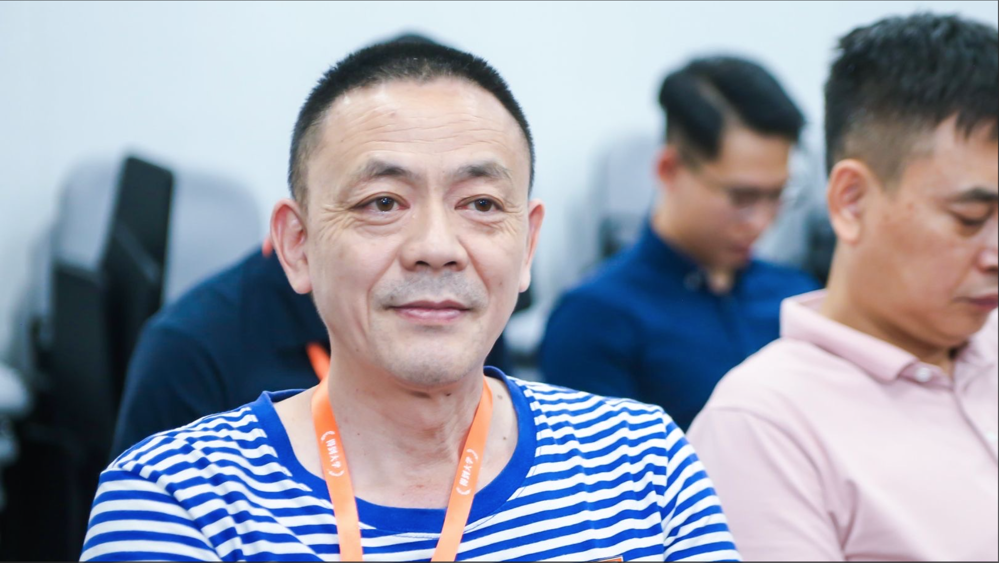

在开始之前，我必须提醒一下老熊。我仔细看了几遍逐字稿，我保证接下来的内容不会涉及亲子话题，也不会煽情。但我还是担心你今晚会变成林黛玉，答应我，老熊，今晚你要挺住，可以吗？

## 话说缘分

说起缘分，真是挺神奇的。我最早不是咱们2班的。我一开始被分到3班，因为给我女儿报了星期天的钢琴课，所以申请换到2班。结果刚调过来没多久，那个音乐机构就跑路了，到现在我没上过一节钢琴课。所以，我大概是我们班最后一个加入班级群的，但是我可能是同学里第一个见过阳阳班班的人。比晓林哥还早，想不想听这个故事啊？有内幕喔

[2019夏季招生图片]

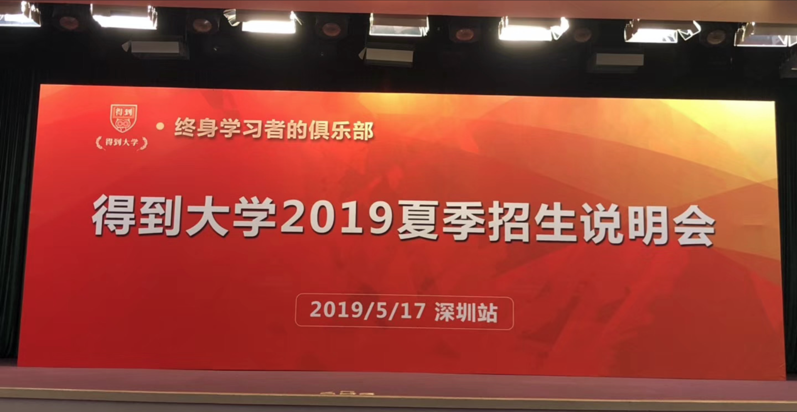

那是在去年的5月17号，罗胖和脱不花来深圳招生，那应该是得到大学第三期吧。班主任们刚刚上岗，我印象很深，脱不花在介绍阳阳班班的时候，说她也不知道阳阳为什么要放弃百万年薪加入得到大学。[这里不应该有掌声和欢呼声吗？同学们，我们在享受百万年薪的服务啊。] 班班，你能给我们讲讲不？

这是那个时候的照片，班班站在一群人中，光彩照人，所以：“得到大学最美班班”这是一句大实话。班班，就像你告诉我们几个钢铁直男不知道自己有多优秀一样，今天我们要告诉你，你不知道自己有多美！

现在你们知道，我为什么换到2班了吧。

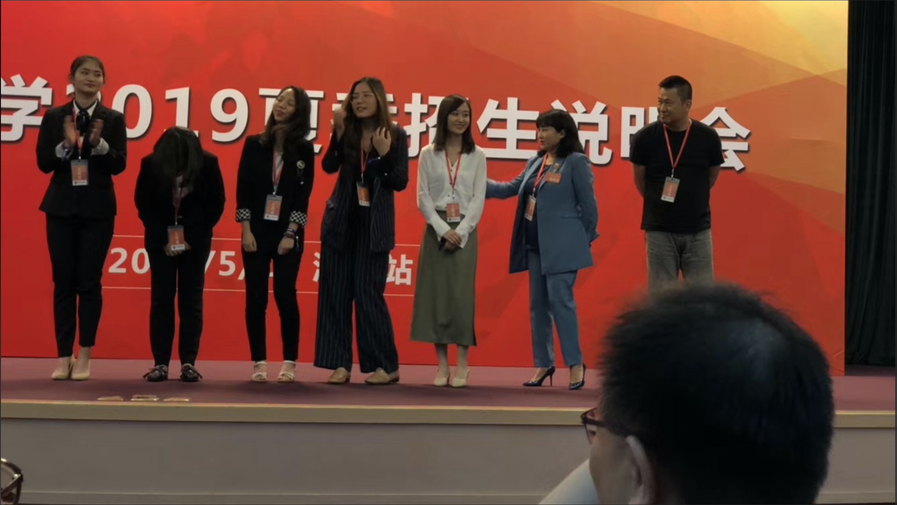

噢，那个后脑勺是罗胖的，我当时坐在他和脱不花的后面。

## 我的故事

今年3月份，我被公司裁员了，拿了5个月的赔偿金。这几个月挺糟心的，不光因为失业，更因为自己长期以来职业焦虑。所以，竞选班委的那天，晓雨在台上说自己曾经有产后抑郁，

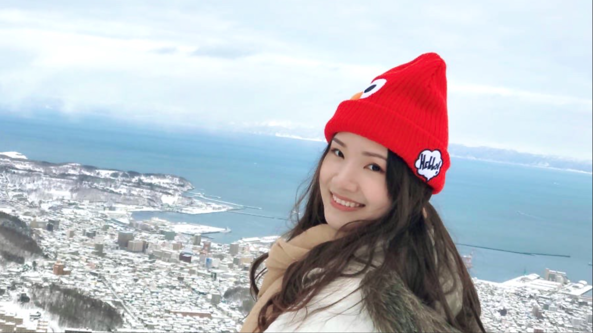

我很想抱一抱她，（不对，好像还没这么熟），很想拍一拍她说：”相信我，你并不孤独“。虽然我没产后，但是我没工作，也很抑郁啊。

我2016年5月8号从厦门来深圳，我喜欢这个城市，朝气蓬勃，有山有海。

但是我发现个问题，来了深圳几年，没什么朋友，上班下班一个人听得到，周末连个喝酒的人都找不到。我不是喜欢喝酒，酒量也一般。只是没人分享，再多的成就都不圆满。没人安慰，苦过了还是酸，咳，我想我是海。我只是喜欢三五好友，在一起吹牛皮侃大山，可以喝到东倒西歪，杯盘狼藉，不觉东方之既白。

## 亲同学们

这种场面，在我们班遇到了。在final分享会结束后，我们十几个人就在校区旁边的木屋烧烤。放一段小视频，大家感受一下。

[视频]

看到湘云没？那天晚上，就她最激动，远生的肚子就是这样被湘云搞大的。

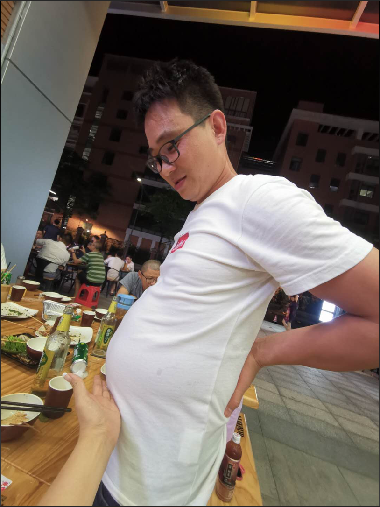

说起湘云，

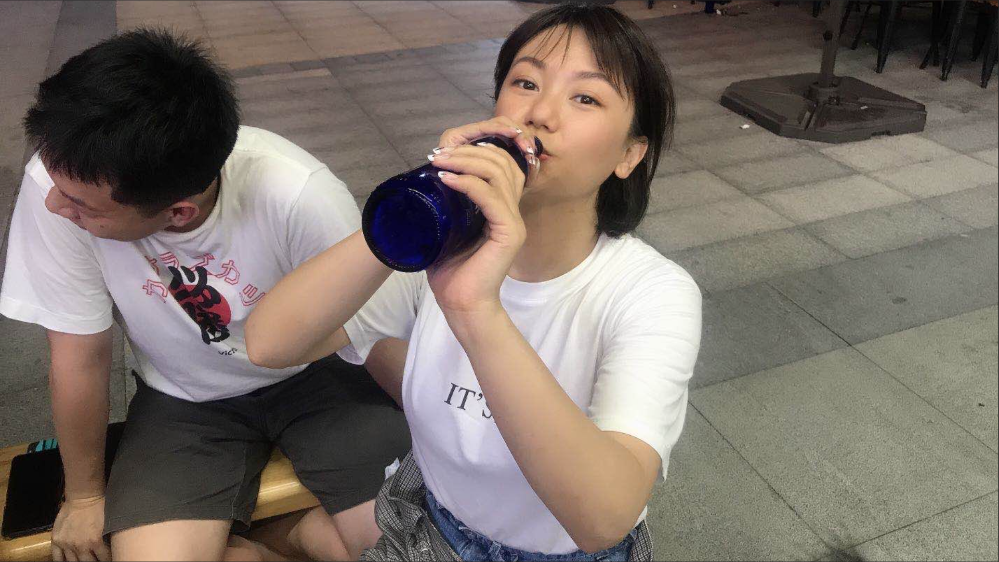

大家记不记得，她第一次分享的时候，说锁匠的手又软又细，那天晚上我借着酒胆问她，怎样才能摸一摸她的手。她很干脆，说：”把你面前那杯酒喝了“，我也很干脆地喝了。你知道被湘云摸着手是什么感觉吗？像是被女神宠幸了一样。湘云，今晚怎么喝？

湘云是8组的，那天晚上他们组是这样的：

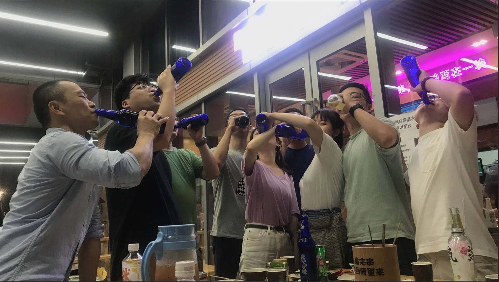

感觉这几个月我跟8组打交道比跟我们组还多，大叔、何律、敬一、劲捷、小狮子，杨梦一个比一个妖娆。

最妖的还是他们组长：

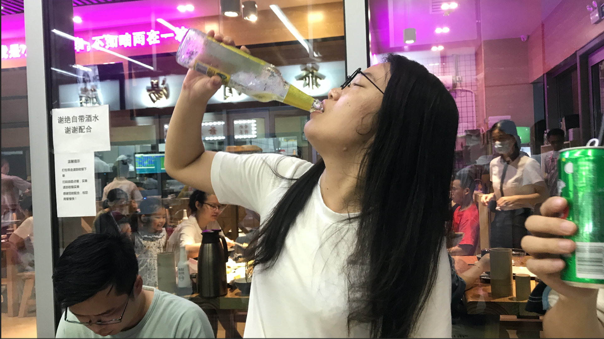

嗯，我喜欢，我说媚儿，你们不是13妖吗？现在只有十一个人，要不把我带上，我们凑一个十二生肖？

不知道大家有没有想过，为什么我们要这么欢乐呢？一个很重要的原因是打磨和毕业设计太苦了，班班太会逼人了。似乎每个上台的人和小组都有自己熬夜的故事。我就不说了吧。

## 我的遗憾

这4个月好快，感觉刚开始就结束了，留下了好多遗憾，比如私董会只参加了一次，更同学链接太少。我举几个例子

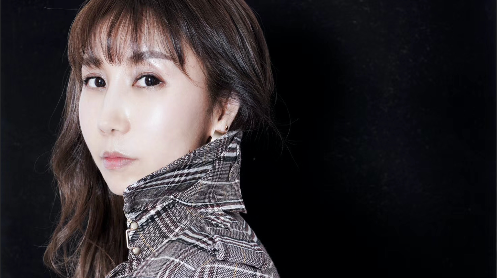

记得好早之前，我在班级群里发过我们组1v1的文字记录，鲁遇第一个主动约我。虽然我可以找到各种借口，说自己为什么没有赴约。主要原因还是自己怂了。你要知道，要跟这么一位有气质又美丽的首席设计师，要跟她1对1，那个压力比上台的压力还要大。

咳，错过就在一念之间，鲁遇，下山了，我还有没有机会？这一张旧船票，能否登上你的客船？

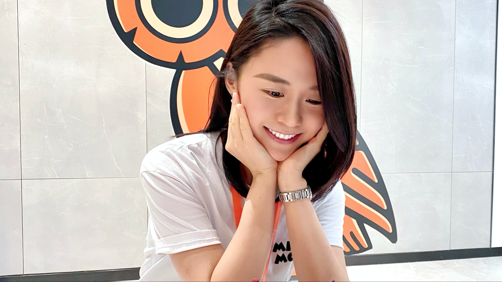

陈雯，我是陈文经。你年纪轻轻，就是百万圆桌的一员，这是很多数人终其一生都到不了的成就，真的是很有才华。我能不能就你保险的问题当面咨询你，半个小时就可以了，[吁吁吁]，咳，我这点小心机大家看破不要说破嘛。 肯定有很多人说你很漂亮。放心，我肯定不会这么说，我们还不熟，我只是想问你，怎么可以这么漂亮？

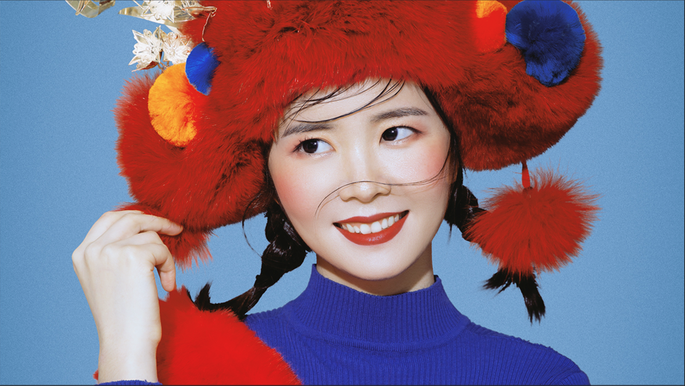

雯静同学，感觉是在叫我自己。笑笑，我喜欢这个名字。一下子能勾起好多回忆，比如沧海一声笑，涛涛两岸潮。古今多少事，都付笑谈中。

比如程浩说：真正牛逼的，不是有什么事迹可以夸耀，而是面对困境依然保持微笑。

咳，说这么多，我其实是想说笑笑笑起来真的很好看。请原谅我还没学会丛媚赞美的套路，程序员赞美的脑回路有点奇葩。

我跟笑笑还没当面说过话。她是阿里的HR，上周天她微信上问我，在哪里做iOS开发，要不要去她们公司。我做梦都想去啊，在投简历之前，我要先确认一下，我应聘的是程序员，不是去讲段子，对吧？

啥时候约一约？嗯，我的赔偿金快用完了，该收拾收拾滚回职场好好工作了。

## 新的开始

说了这么多遗憾，我到底想说什么呢？“这是我做的最开心的一次PPT”？。

我还想说的是，正如大家现在看到的：这个时代的红利，将集中到每个行业最会公共表达的人身上。

我是文经，程序员，不太擅长交际，还有好多同学都不认识，欢迎大家链接我，带我一起飞，我们待会儿聊，谢谢！

