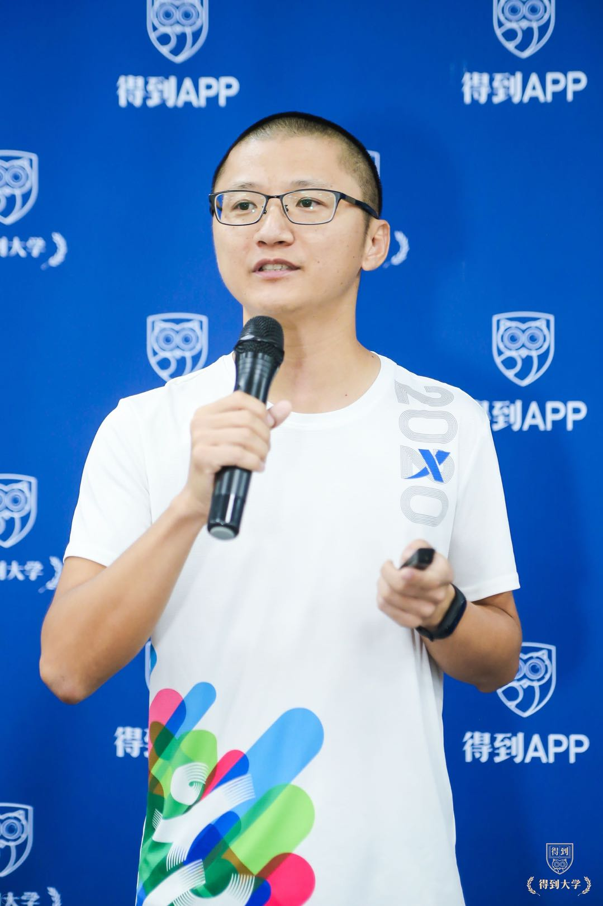

## **陈文经**  

互联网/iOS研发工程师

wechat: JonathanStevens

## 你将了解的我

1984年生，iOS软件工程师。 来自福建泉州，07年毕业于福建福州大学。之前主要在福州，厦门工作，2016年来深圳，坐标宝安西乡街道。

目前处于自由状态，寻找下一个发展和成长机会。 

## 与众不同的我

1. 一个非典型的程序员，目前主要关注领域：iOS开发、Python大数据和人工智能、小程序开发。 
2. 得到App的深度用户，学分822（2020/09/02) 。
3. 长跑爱好者，从2012年起连续9年参加厦马马拉松，最好成绩大概是3小时45分钟，一年会参加2-3次马拉松。 
3. 徒步登山爱好者。比较经常混迹于梧桐山。19年中秋假期，一个人背上睡袋、食物三天三夜走完香港麦理浩径全程100公里。是磨坊户外的初级户外领队。 

## 得到大学的我

深圳6期2班1组“长征1号”的组长，2.5次登台分享，我在得到大学做过的事情、下山后正在做和将要做的事情可以查看我在[得到大学](https://gitee.com/lanjing99/IAmAtDedaoUniversity)，会逐步更新。

下山后目前主要在做两件和同学们相关的事： 

1. 发起了一个“20小时Python”的学习小组，面向得到大学同学和校友，目标是用20个小时学会这门语言。目前正在进行中，具体内容可以查看[20小时Python](https://gitee.com/lanjing99/TwentyHoursPython)，有个“20小时Python”的校友群，欢迎联系我加入。 

2. 和丛媚还有2班的小伙伴一起发起跑徒社，是一个跑步徒步的社团，组织大家一起健康专业跑步，每个月会组织一次户外活动。 

## 得到微信的我

