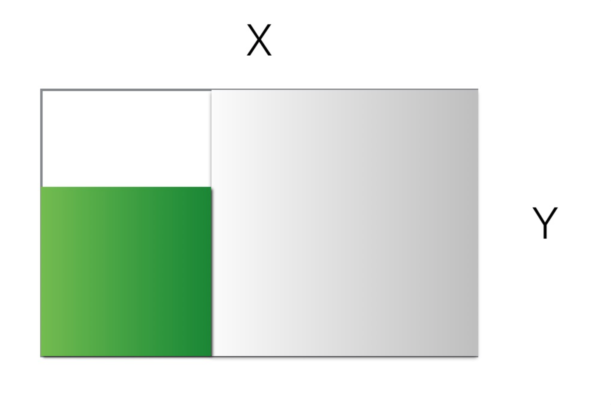
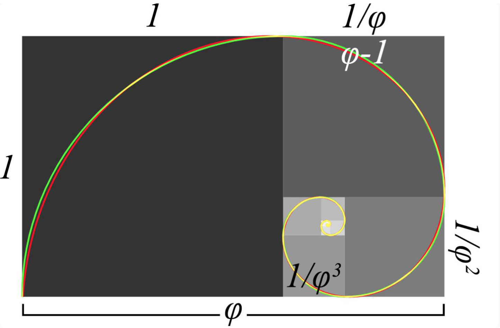
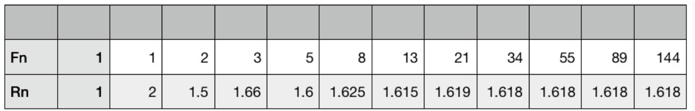

# 吴军-数学通识50讲
# 导论
## 发刊词|数学到底应该怎么学？
很多学习数学的人会感觉自卑，并产生厌恶。这是为什么呢？当然不是数学本身的问题，也不是我们人的问题，而是因为我们和数学之间缺失了一个桥梁。**数学是一种抽象的知识体系，而我们人要靠经验感知才能认识世界，这中间需要一个桥梁，这个桥梁一旦构建起来，每一个人都能受益于数学。**

那么在我的数学课中，我会教什么？大家又应该怎么学？学完以后应该怎么用呢？
在教学方面，我会模仿美国的数学教学方式，为你做好三件事，也是我这门数学课的三个教学特色：

首先，我会为你重建这座通往数学的桥梁，帮你把那些熟悉的知识点各安其位，放进知识体系里。我的讲法是把一门数学课从完整的体系变成一个个的知识点，讲透之后，再还原回体系。让你能够熟练地把握知识点和课程体系的关系，这门课的体系也就搭建好了。

其次，在介绍这些关键数学知识点的同时，我会讲清楚它们在数学上的位置，以及和各种知识体系的相关性。这样不仅能够把各种知识打通，而且能够让你在自己的行业中超越绝大部分从业者。

最后一点，也是最重要的，是通过学习数学，实现思维方式的跃进。为了做到这一点，并不需要讲述太难的数学知识，而是需要讲透。

事实上，我们无论是讲透毕达哥拉斯定理，还是更难懂一些的欧拉公式，都可以在讲述的过程中将数学家超出凡人的思维方式讲清楚。毕竟对于大部分人来讲，一辈子用不到欧拉公式，如果他们不容易理解，用简单的例子把道理讲清楚就变得格外重要了。

至此，我为你搭建的桥梁就算建造好了，当然，还是需要你亲自从这头走到那头去，我们接下来谈谈你怎么做，才能跟着我学好数学：
>一个学好数学最重要的办法是，不断训练自己的思维方式。

很多人喜欢读侦探小说和悬念小说，喜欢解决各种谜题，这其实是人类的一种天性，也是对头脑的一种训练。学数学能够提高我们这方面的能力，让自己成为一个“深入的思考者”（Deep Thinker）。

### 我的收获 lanjing

> 数学学习的方法
> 美国的数学教学方法
> 数学学习的3个要
> 1. 有整个知识体系的轮廓，分解成知识点，再回到体系
> 2. 重要知识点在整个体系中的位置，以及和其它知识点的联系
> 3. 通过数学实现思维方式的跃迁

## 01 导论：数学通识课的体系和学习攻略

数学的各个分支，无论难易，从体系到研究方法，再到应用方法是共通的。
成年人接受数学通识教育，其实只要做到一点就够了，就是从理解初等数学到理解高等数学——（也就是）把自己对所有和数学相关的概念和方法的理解程度，从静态的、具体的，上升到动态的、规律性的。要达到这个目的，不需要讲很多内容，但需要一些线索。

### 课程模块

第一模块讲的是数学究竟是怎么从一个猜想，得出推论，然后又产生实际应用的。
毕达哥拉斯是将数学从经验上升到系统性学科的第一人。他确立了数学的起点，也就是必须遵循严格的逻辑证明才能得到结论的研究方法，这就让数学从早期那些需要靠测量和观测的学科，比如天文学、地理学和物理学中，脱身出来，成为所有基础学科之上，带有方法论性质的特殊学科。

我们在第一模块“数学的线索”里面，以毕达哥拉斯为线索，一方面将很多数学知识点串联起来，向大家展示数学是什么样的体系，另一方面，我们把毕达哥拉斯作为例子，说明数学发展和体系构建常常经历的步骤。也就是，从特例到引理再到定理、推论，最后到应用的全过程

课程的第二个模块“数的概念”，通过讲述人类对数字这个概念的认识历程，我会给你一个思维工具——“从具体到抽象”，从而解释为什么你从小学数字，但其实对数字的认识并没有提高，以及学数学多年都不能为己所用的原因。

第三、第四模块的内容集中在我们熟知的几何和代数。在几何的模块中，我们会以它为例子介绍什么是公理化的知识体系，它是如何建立的。
在代数的模块中，我们会重点介绍函数和向量。函数这个概念的发明，把我们人类的认知从个体上升为整体，从单点联系，上升为规律性的网状联系。

五模块是微积分，这已经是高等数学的内容了。但是，我们其实在第二模块里已经不知不觉地把微积分中最难的内容提前讲了，因此在这个模块，大家反而会觉得简单。
对于微积分，它和初等数学的工具有什么不同呢？人们开始对把数学从关注静态的关系，变成了对动态规律，特别是瞬间规律的把握上。理解这一点，并且主动应用到工作中，是我们学习微积分的目的。那些很难的概念，解题技巧，其实毫不重要。

好，前面你学习了数学公理、数字、几何、代数和微积分，提纲挈领地回顾了数学发展的历史，这些分支有个特点，就是能给出问题唯一的答案。
但是到了近代，很多现实问题很难有完全确定的答案。于是，为了研究不确定世界的规律性，概率和统计发展起来了。数学的这个分支在今天我们充满不确定性的世界里非常重要，也是所谓的大数据思维的科学基础。
纵观数学发展的历程，以及我们应该具有的数学思维历程，我们可以看到这样的趋势，从个案到整体规律，从个别定理到完整的知识体系，从具体到抽象，从完全的确定性，到把握不确定性。
无论是在整个的课程中，还是每一个模块之内，我们都能看到这样人类认知升级的过程。当然，我觉得这也应该是我们自己的认知升级过程。
在课程的最后，我们会介绍数学和其它学科的关系。这样能够在完整的知识体系中，更好地理解数学。接下来，我们就先从毕达哥拉斯讲起，从数学的起点开始我们的数学之旅。

### 我的收获 lanjing

> 吴军对数学这门学科的认识，学习的方法。
>
> 数学的各个分支，无论难易，从体系到研究方法，再到应用方法是共通的
>
> 纵观数学发展的历程，以及我们应该具有的数学思维历程，我们可以看到这样的趋势，从个案到整体规律，从个别定理到完整的知识体系，从具体到抽象，从完全的确定性，到把握不确定性。

# 模块一：数学的线索

## 02 勾股定理：为什么在西方叫毕达哥拉斯定理

数学与自然科学的三个本质差别，也是这一讲最重要的三个知识点，它们能够帮助我们理解数学特殊的方法和思维方式，或者说了解数学的推理世界与我们真实的测量世界的区别。

1. 测量和逻辑推理的区别

2. 用事实证实和用逻辑证明的区别

   在自然科学中，一个假说通过实验证实，就变成了定律。

   今天几乎所有的自然科学的定律和理论，不仅存在一个被推翻的可能性，而且有很多的例外。比如，证实引力波的实验，也只能保证99.9999%的可能性结论是对的。

   但是，在数学上，用实验来验证一个假说（在数学上常常被称为猜想）是不被允许的，我们在后面介绍无穷大时，大家还会看到这甚至是做不到的。数学的结论只能从逻辑出发，通过归纳或者演绎得出来。它必须完全正确，没有例外，因为但凡有一个例外（也被称为反例），就要被完全否定掉。这里面最著名的例子就是哥德巴赫猜想。

   今天人们利用计算机，在可以验证的范围内，都验证了这个猜想是对的，但是因为没有穷尽所有的可能，就不能说猜想被证明了。因此，我们依然不能在这个基础上，构建其它的数学定理。

   所以，数学世界和测量世界第二个区别就是，数学理论必须要证明，保证没有例外。

3. 科学结论相对性和数学结论绝对性的区别

   为什么数学要那么严格，它的定理为什么不能有任何例外，更不能特殊情况特殊处理呢？因为数学上的每一个定理都是一块基石，后人需要在此基础上往前走，试图建立一块新的基石，然后数学的大厦就一点点建成了。在这个过程中不能有丝毫的缺陷，一旦有，整个数学大厦就轰然倒塌了。

   还是以勾股定理为例，它的确立，其实教会了人们在平面计算距离的方法，在此基础之上，三角学才得以建立，笛卡尔的解析几何才得以确立，再往上才能建立起微积分等数学工具。此外我们这个模块后面会讲到的无理数的出现、黄金分割，都和它有关。

   有了一个个的定理，数学就得以建立起来，而且这个建立在逻辑推理基础上的大厦很坚固。

数学定理确立的过程大致是这样的，一开始可能只是大家注意到几个特例，然后发现很多例证提出猜想，猜想经过证明就成为了定理，定理会有推论，在此基础上，会有新的定理和应用。

### 我的收获 lanjing

> 1. 数学的基础是最坚实的，从一个正确的基础形成一个体系。
> 2. 数学也是一门有着独一无二地位的学科，值得好好学习。

## 03 数学的预见性：如何用推理走出知识盲区

无理数的出现于证明：

有理数：可以表达为两个整数比的数。

无理数：和无理数对应

既然在推导没有错误时，通常是我们的观察或者认知欺骗了我们，那么我们就应该把危机看成是转机。人类在科技历史上，很多重大的发明发现恰恰来自于上述的矛盾。

在自然科学上，很多重大的发现，最初都不是直接和间接观测到的，而是根据数学推导出来的，比如说黑洞、引力波便是如此。在历史上，血液循环论、现代原子论最初都是建立在数学推导上的假说，然后才逐渐被实验验证了。
世界上有很多我们不能依靠直觉和生活经验理解的事物，但是我们可以从数学出发，经过一步步推导得到正确的结论，我们甚至不需要亲力亲为地做一遍就知道我们的结论一定是正确的。

康德讲：“世界上只有两样东西是值得我们深深景仰的，一个是我们头上的灿烂星空，另一个是我们内心的崇高道德法则。”他所说的星空，其实包括数学这样的知识体系。对于很多云山雾罩的事情，我们只需要在逻辑上推演一遍，就能把问题的真相搞清楚了

### 我的收获lanjing

> 有些路不需要用脚走，只需在脑袋里走一遍就可以了，数学就是这样的工具。逻辑上的合理性。
>
> 如果说，有什么东西可以坚信不疑的，那就是数学公里、定理。
>
> "in math, we believe"

## 04 数学思维：数学家如何从逻辑出发想问题

数学思维高深精妙，但是万法归一，最重要的那个原则就是，从逻辑出发想问题，这样就可以发现很多日常中被忽略的问题，从而找出真正答案。

2008年金融危机的例子。电影”大空头“

接下来我们就说说什么叫做具有数学的思维。它不是指算小账算得清楚，而是说善于基于数学知识，使用逻辑发现问题，或者预见到不得不做的事情。我们在生活中，有时不得不面对非常复杂的问题，里面有很多噪音难以一一滤出，这时就需要掌握一种工具让我们能够不受噪音影响作出正确的判断。而数学常常是我们可以信赖的工具。

中国如何维持经济增长？资本输出？

我们在生活中，常常说“算笔账”这三个字。其背后其实就是说基于一些事实，用数学这个工具来考量，发现问题。为什么数学思维可以很容易地发现问题呢？因为我们常常用到在数学证明中的工具：矛盾律。
就是说一个事物不能既有A属性，又没有A属性。比如我们上一讲在证明√2是无理数时说到，如果它是有理数P/Q，那么P和Q这两个整数，既不能同时是素数，又必须同时是偶数，这就违背了矛盾律。同样，中国既不可能拥有全世界所有的财富，还让世界其它地区买得起中国的商品，这也违背了矛盾律。

### 我的收获 lanjing

## 05 数学的边界：从毕达哥拉斯定理到费马大定理

### 费马大定理

那么证明这个古老的数学难题有什么意义呢？这个定理证明过程本身导致了很多数学研究成果的出现，特别是对于椭圆方程的研究。今天区块链技术用到的椭圆加密方法，就是以它为基础的。

在怀尔斯之前，有一批数学家，特别是日本的谷山丰，对这一系列理论做出了重大的贡献，怀尔斯的成功是在他们的工作基础之上的。今天的比特币可以讲完全是谷山丰理论的一次有意义的应用。而在怀尔斯之后，泰勒等人还在不断发展这方面的理论。
对于三个世纪数学家们证明费马大定理的过程，我和大家分享我的三点体会：

1. 今天的数学（指纯粹数学，不是应用数学）真的很难，想在这方面取得突破性贡献不容易，怀尔斯从10岁开始就立志解决这个问题，他努力了30年。他最后的证明长达200页。但是，有了理论，使用它做有意义的事情，还是容易得多。比特币就是一个很好的例子。
2. 数学是世界上最严密的知识体系，任何的推导不能有丝毫的纰漏。怀尔斯差点因为一个小的疏忽毁掉了整个工作，希望通过这一点，大家对数学的严密性有所体会。
3. 数学走到今天这一步，是在一个个定理的基础上一点点搭建起来的，而今天的成就，又为明天的发展奠定了基础，这样数学就获得了可叠加的进步。

很多问题最后证明找不到严格推导出来的解析解，当然这也不妨碍大家在工程上可以使用近似的数值解，解决实际问题。认清这一点，做事的方法也就改变了。

我们通过希尔伯特第十问题介绍了数学的边界，这是一个硬的边界，大家不要试图逾越。但是数学的边界有些时候不是我们解决问题的边界，因为世界上除了数学的方法，还有其他方法。

### 我的收获 lanjing

> 1. 数学虽然可靠，但有其边界，用它不能解决的问题远比可以解决的问题要多，所以我们需要多元思维模型。
> 2. 

## 06 黄金分割：毕达哥拉斯如何连接数学和美学

那么黄金分割是如何确定的呢，这个比例为什么看起来顺眼呢？简单地讲，它的美感来自几何图形的相似性

### 黄金分割的计算

比如我画了一个符合黄金分割的长方形，它的长度是X，宽度是Y。如果我们用剪刀从中剪掉一个边长为Y的正方形（也就是图中灰色的部分），剩下来的长方形，长宽之比依然会符合黄金分割。
当然，我们还可以继续剪掉一个正方形（图中绿色的部分），剩下的长方形（图中透明的部分）的长宽依然会符合黄金分割的比例

x-y/y = x/y ，当x = 1时，解二元一次方程

黄金分割为什么漂亮？除了在几何上层层相似，这个相似性之外，它也反映了自然界的物理学特征。如果我们把刚才图中的长方形不断做切割，然后将每个被切掉的正方形的边用圆弧替代，就得到了这样一个螺旋线。由于这个螺旋线每转动同样的角度，得到的圆弧是等比例的，因此它也被称为等角螺线。如果你对比这个螺旋线和下面的蜗牛壳，是否觉得很相似

不仅蜗牛壳如此，龙卷风的性质乃至像银河系这样星系的形状都是如此。需要指出的是，这不是巧合，而是因为任何东西如果从中心出发，同比例放大，必然得到这样的形状。

A4纸的由来，sqrt（2）白银比例

毕达哥拉斯认为，要产生让人愉快的音乐，就不能随机在连续的音调中选择音阶，而需要根据数学上的比例设计：
首先，人们发现两根琴弦，如果它们的长度比是2:1，它们所奏出来的音节就相差一个8度，如果我们用简谱来记录，也就是1-2-3-4-5-6-7-i，高音1的音高是中音1的两倍。在这一个8度中最高音和最低音的频率之比也就是为2:1。
接下来，将这8度又一分为二，按照4:3和3:2的比例，分出一个4度音和一个5度音，它们分别对应1-2-3-4和4-5-6-7-i。注意，由于4/3 x 3/2 = 2:1，因此一个4度音和一个5度音会还原成一个8度音。
最后，每个4度音分成两个整声调，即分出2和3，5度音分为三个整声调，即分出5，6，7。这样就是按照比例设计的了。

### 绘画

透视法

消失点

等比例缩放

## 07 数学应用：华罗庚化繁为简的神来之笔

很多真正高水平的数学家，他们不仅能够研究复杂的理论问题，还能够为复杂的实际问题找到简单的，可重复使用的解决方法，比如我国老一辈著名的数学家华罗庚先生。华先生是20世纪唯一一位能够称得上是世界级的中国数学家，他在数论等方面有很多贡献。

“于是1958年，华罗庚先生就率领了一大批数学家走出大学和科学院大门，到工农业生产单位去寻求实际问题进行研究，提出解决方案。”“但是华先生却没有怪大家水平低，而是觉得自己依然没有把数学变得更简单，于是他进一步总结经验，制定出一套易于被人接受、应用面广的数学方法。”

### 我的收获 lanjing

这一点没明白的是，

优选法和折半查找的效率如何对比？

## 08 数列和级数（一）：当下很重要，但趋势更重要

斐波那契数列

1. 生物学的解释：

   > 一对兔子，它们生下了一对小兔子，前面的我们叫做第一代，后面的我们叫做第二代。然后这两代兔子各生出一对兔子，这样就有了第三代。这时第一代兔子老了，就生不了小兔子了，但是第二、第三代还能生，于是它们生出了第四代。然后它们不断繁衍下去。那么请问第N代的兔子有多少对？这个数列，就是1，1，2，3，5，8，13，21，……

2. 斐波那契数列的比值

   我们再用Rn，代表Fn+1和Fn的比值，也就是后一个数和前一个数的比值，你可以把它们看成是数列增长的相对速率。

我们课程从毕达哥拉斯，讲到黄金分割，然后通过黄金分割，由此把一些数学知识关联起来。这其实就是一个学习数学的技巧了，绝大部分时候不在于题做得有多难，而在于你闭上眼睛，能够用一两条关键的线索把各个知识点串联起来。

等比数列在碳-14测定的应用，古时候的大气跟现在应该并不同吧，如何确定？

>今天用于测定年代的碳-14测定法，利用的就是这个原理。碳-14是自然界里一种天然的元素，是宇宙射线照射大气的产物，因此它会不断产生，但是它有放射性，因此过一段时间会衰变掉一部分，于是它在自然界保持着一个动态平衡。
>生物体在活着的时候，会吸入大气中的碳-14元素（通过二氧化碳），因此它体内的比例就和自然界的比例相同。但是生物体一死，就不会再吸入碳-14了，因此体内碳-14的比例就会逐渐降低。
>根据生物遗骸体内碳-14的比例，结合碳-14衰变的速率（也称为半衰期），就能算出古代生物体距今的时间。

数列，其实讲的就是一个趋势。很多时候，我们不仅关心当前这个数有多大，或者我们有多少钱，多少资源，还关心明天它能变得多大，变得多快，这就是数列的意义。至于等差数列，其实是缓慢上涨的，即使每一个都比前面的大，到后来的增长也很不明显。

## 09 数列和级数（二）：传销骗局的数学原理

我们来讲讲数列的求和，也就是所谓的级数。

发散级数

收敛级数

### 生活中的例子

老鼠会的看似无限的收入

社交网络的信息传播

核裂变链式反应的临界体积计算

### 延伸扩展

1. 贴现率
2. 永续年金
3. 保险的收益计算（看来还是要掌握工具啊）

## 10  数列和级数（三）：藏在利息和月供里的秘密

假定你买房要向银行贷款120万，年化利率是6%，那么月利率是0.486%，接近0.5%， （这个是怎么计算的？级数和，然后计算？），用计算器怎么算？

### 不同的还款方式

#### 等额本金

第一种被称为等额本金偿付，这种方法顾名思义，就是每个月还的本金数相同。利息是随着本金归还后，不断减少的。

#### 等额本息

等额本息偿付，就是说把贷款的本金和利息都加起来，除以还款期数，这样每个月还的本金和利息都是相同的。在这种情况下，每个月还款中一部分被用于还了利息，剩下的才用于减少所欠的本金。那么每个月要付多少钱呢？

等额本息偿付的本金和利息计算相对复杂。

很多人会说，我还是算不清这里面的账，没关系，只要记住下面两个原则即可：

> 1. 借钱不要去所谓的P2P一类的机构。
> 2. 永远记住“卖的人比买的人精”，不要试图贪便宜

国库券：央行加息，贬值；央行降息，增值。

### 延伸

“数学助教”  - 等额本息偿付的月供计算

# 模块二：数的概念

# 模块三：几何学

# 模块四：代数学

# 模块五：微积分

# 模块六：概率、统计和博弈论

# 模块七：数学的基础作用