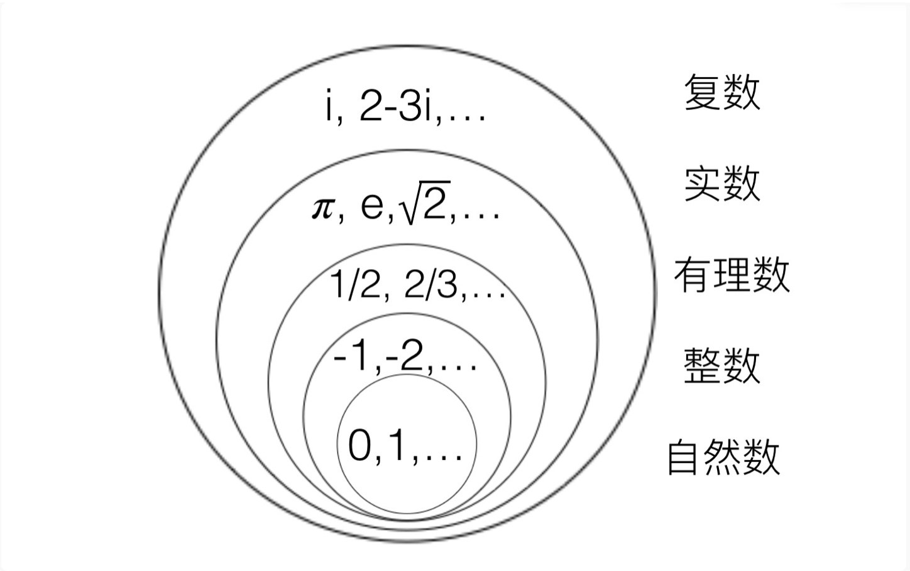
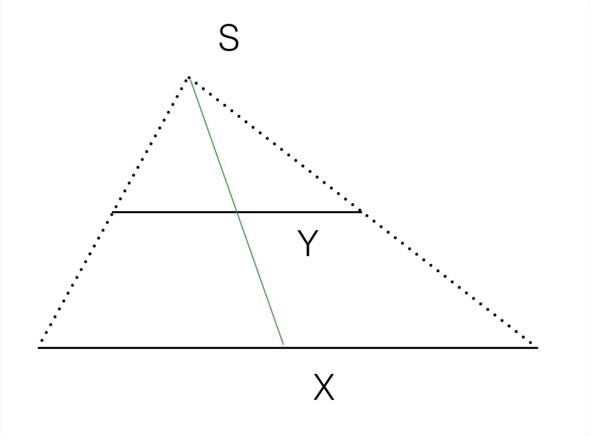
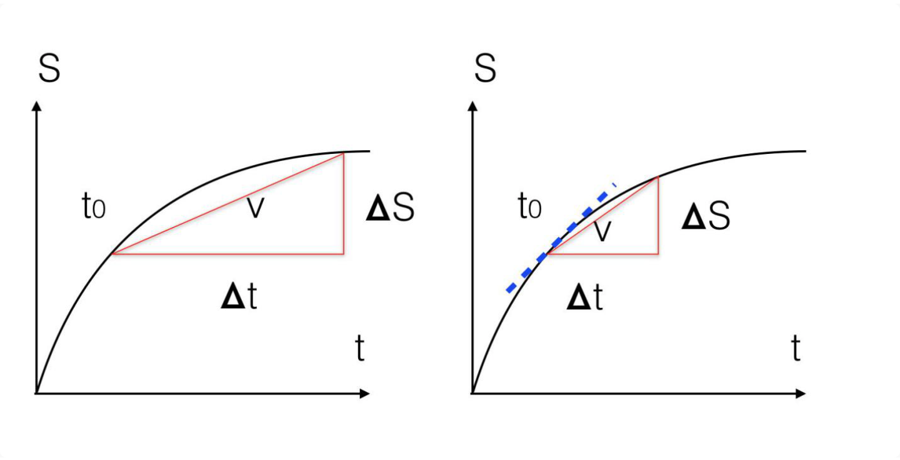
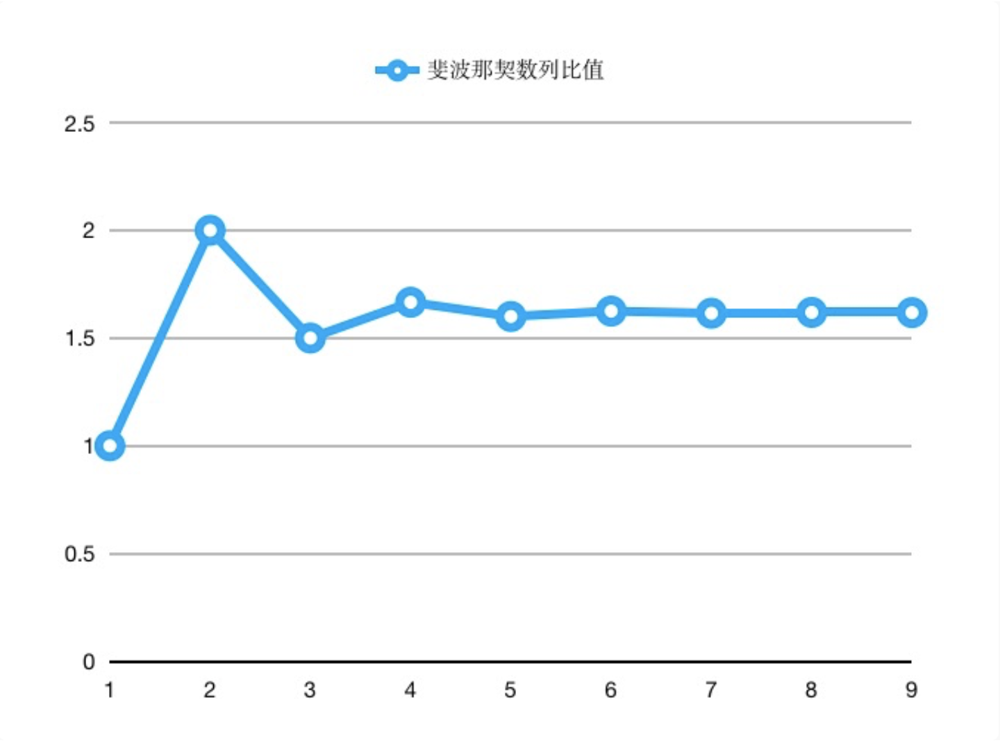

# 吴军-数学通识50讲

## 扩展学习

1. Mathematica 软件的使用，这款软件可以推导你能遇到的几乎所有数学公式，他的编写者沃夫兰姆是一位真正的天才。20岁便博士毕业了。以及mathlab（这个也顺便看一下）

# 导论

## 发刊词|数学到底应该怎么学？
很多学习数学的人会感觉自卑，并产生厌恶。这是为什么呢？当然不是数学本身的问题，也不是我们人的问题，而是因为我们和数学之间缺失了一个桥梁。**数学是一种抽象的知识体系，而我们人要靠经验感知才能认识世界，这中间需要一个桥梁，这个桥梁一旦构建起来，每一个人都能受益于数学。**

那么在我的数学课中，我会教什么？大家又应该怎么学？学完以后应该怎么用呢？
在教学方面，我会模仿美国的数学教学方式，为你做好三件事，也是我这门数学课的三个教学特色：

首先，我会为你重建这座通往数学的桥梁，帮你把那些熟悉的知识点各安其位，放进知识体系里。我的讲法是把一门数学课从完整的体系变成一个个的知识点，讲透之后，再还原回体系。让你能够熟练地把握知识点和课程体系的关系，这门课的体系也就搭建好了。

其次，在介绍这些关键数学知识点的同时，我会讲清楚它们在数学上的位置，以及和各种知识体系的相关性。这样不仅能够把各种知识打通，而且能够让你在自己的行业中超越绝大部分从业者。

最后一点，也是最重要的，是通过学习数学，实现思维方式的跃进。为了做到这一点，并不需要讲述太难的数学知识，而是需要讲透。

事实上，我们无论是讲透毕达哥拉斯定理，还是更难懂一些的欧拉公式，都可以在讲述的过程中将数学家超出凡人的思维方式讲清楚。毕竟对于大部分人来讲，一辈子用不到欧拉公式，如果他们不容易理解，用简单的例子把道理讲清楚就变得格外重要了。

至此，我为你搭建的桥梁就算建造好了，当然，还是需要你亲自从这头走到那头去，我们接下来谈谈你怎么做，才能跟着我学好数学：
>一个学好数学最重要的办法是，不断训练自己的思维方式。

很多人喜欢读侦探小说和悬念小说，喜欢解决各种谜题，这其实是人类的一种天性，也是对头脑的一种训练。学数学能够提高我们这方面的能力，让自己成为一个“深入的思考者”（Deep Thinker）。

### 我的收获 lanjing

> 数学学习的方法
> 美国的数学教学方法
> 数学学习的3个要
> 1. 有整个知识体系的轮廓，分解成知识点，再回到体系
> 2. 重要知识点在整个体系中的位置，以及和其它知识点的联系
> 3. 通过数学实现思维方式的跃迁

## 01 导论：数学通识课的体系和学习攻略

数学的各个分支，无论难易，从体系到研究方法，再到应用方法是共通的。
成年人接受数学通识教育，其实只要做到一点就够了，就是从理解初等数学到理解高等数学——（也就是）把自己对所有和数学相关的概念和方法的理解程度，从静态的、具体的，上升到动态的、规律性的。要达到这个目的，不需要讲很多内容，但需要一些线索。

### 课程模块

第一模块讲的是数学究竟是怎么从一个猜想，得出推论，然后又产生实际应用的。
毕达哥拉斯是将数学从经验上升到系统性学科的第一人。他确立了数学的起点，也就是必须遵循严格的逻辑证明才能得到结论的研究方法，这就让数学从早期那些需要靠测量和观测的学科，比如天文学、地理学和物理学中，脱身出来，成为所有基础学科之上，带有方法论性质的特殊学科。

我们在第一模块“数学的线索”里面，以毕达哥拉斯为线索，一方面将很多数学知识点串联起来，向大家展示数学是什么样的体系，另一方面，我们把毕达哥拉斯作为例子，说明数学发展和体系构建常常经历的步骤。也就是，从特例到引理再到定理、推论，最后到应用的全过程

课程的第二个模块“数的概念”，通过讲述人类对数字这个概念的认识历程，我会给你一个思维工具——“从具体到抽象”，从而解释为什么你从小学数字，但其实对数字的认识并没有提高，以及学数学多年都不能为己所用的原因。

第三、第四模块的内容集中在我们熟知的几何和代数。在几何的模块中，我们会以它为例子介绍什么是公理化的知识体系，它是如何建立的。
在代数的模块中，我们会重点介绍函数和向量。函数这个概念的发明，把我们人类的认知从个体上升为整体，从单点联系，上升为规律性的网状联系。

五模块是微积分，这已经是高等数学的内容了。但是，我们其实在第二模块里已经不知不觉地把微积分中最难的内容提前讲了，因此在这个模块，大家反而会觉得简单。
对于微积分，它和初等数学的工具有什么不同呢？人们开始对把数学从关注静态的关系，变成了对动态规律，特别是瞬间规律的把握上。理解这一点，并且主动应用到工作中，是我们学习微积分的目的。那些很难的概念，解题技巧，其实毫不重要。

好，前面你学习了数学公理、数字、几何、代数和微积分，提纲挈领地回顾了数学发展的历史，这些分支有个特点，就是能给出问题唯一的答案。
但是到了近代，很多现实问题很难有完全确定的答案。于是，为了研究不确定世界的规律性，概率和统计发展起来了。数学的这个分支在今天我们充满不确定性的世界里非常重要，也是所谓的大数据思维的科学基础。
纵观数学发展的历程，以及我们应该具有的数学思维历程，我们可以看到这样的趋势，从个案到整体规律，从个别定理到完整的知识体系，从具体到抽象，从完全的确定性，到把握不确定性。
无论是在整个的课程中，还是每一个模块之内，我们都能看到这样人类认知升级的过程。当然，我觉得这也应该是我们自己的认知升级过程。
在课程的最后，我们会介绍数学和其它学科的关系。这样能够在完整的知识体系中，更好地理解数学。接下来，我们就先从毕达哥拉斯讲起，从数学的起点开始我们的数学之旅。

### 我的收获 lanjing

> 吴军对数学这门学科的认识，学习的方法。
>
> 数学的各个分支，无论难易，从体系到研究方法，再到应用方法是共通的
>
> 纵观数学发展的历程，以及我们应该具有的数学思维历程，我们可以看到这样的趋势，从个案到整体规律，从个别定理到完整的知识体系，从具体到抽象，从完全的确定性，到把握不确定性。

# 模块一：数学的线索

## 02 勾股定理：为什么在西方叫毕达哥拉斯定理

数学与自然科学的三个本质差别，也是这一讲最重要的三个知识点，它们能够帮助我们理解数学特殊的方法和思维方式，或者说了解数学的推理世界与我们真实的测量世界的区别。

1. 测量和逻辑推理的区别

2. 用事实证实和用逻辑证明的区别

   在自然科学中，一个假说通过实验证实，就变成了定律。

   今天几乎所有的自然科学的定律和理论，不仅存在一个被推翻的可能性，而且有很多的例外。比如，证实引力波的实验，也只能保证99.9999%的可能性结论是对的。

   但是，在数学上，用实验来验证一个假说（在数学上常常被称为猜想）是不被允许的，我们在后面介绍无穷大时，大家还会看到这甚至是做不到的。数学的结论只能从逻辑出发，通过归纳或者演绎得出来。它必须完全正确，没有例外，因为但凡有一个例外（也被称为反例），就要被完全否定掉。这里面最著名的例子就是哥德巴赫猜想。

   今天人们利用计算机，在可以验证的范围内，都验证了这个猜想是对的，但是因为没有穷尽所有的可能，就不能说猜想被证明了。因此，我们依然不能在这个基础上，构建其它的数学定理。

   所以，数学世界和测量世界第二个区别就是，数学理论必须要证明，保证没有例外。

3. 科学结论相对性和数学结论绝对性的区别

   为什么数学要那么严格，它的定理为什么不能有任何例外，更不能特殊情况特殊处理呢？因为数学上的每一个定理都是一块基石，后人需要在此基础上往前走，试图建立一块新的基石，然后数学的大厦就一点点建成了。在这个过程中不能有丝毫的缺陷，一旦有，整个数学大厦就轰然倒塌了。

   还是以勾股定理为例，它的确立，其实教会了人们在平面计算距离的方法，在此基础之上，三角学才得以建立，笛卡尔的解析几何才得以确立，再往上才能建立起微积分等数学工具。此外我们这个模块后面会讲到的无理数的出现、黄金分割，都和它有关。

   有了一个个的定理，数学就得以建立起来，而且这个建立在逻辑推理基础上的大厦很坚固。

数学定理确立的过程大致是这样的，一开始可能只是大家注意到几个特例，然后发现很多例证提出猜想，猜想经过证明就成为了定理，定理会有推论，在此基础上，会有新的定理和应用。

### 我的收获 lanjing

> 1. 数学的基础是最坚实的，从一个正确的基础形成一个体系。
> 2. 数学也是一门有着独一无二地位的学科，值得好好学习。

## 03 数学的预见性：如何用推理走出知识盲区

无理数的出现于证明：

有理数：可以表达为两个整数比的数。

无理数：和无理数对应

既然在推导没有错误时，通常是我们的观察或者认知欺骗了我们，那么我们就应该把危机看成是转机。人类在科技历史上，很多重大的发明发现恰恰来自于上述的矛盾。

在自然科学上，很多重大的发现，最初都不是直接和间接观测到的，而是根据数学推导出来的，比如说黑洞、引力波便是如此。在历史上，血液循环论、现代原子论最初都是建立在数学推导上的假说，然后才逐渐被实验验证了。
世界上有很多我们不能依靠直觉和生活经验理解的事物，但是我们可以从数学出发，经过一步步推导得到正确的结论，我们甚至不需要亲力亲为地做一遍就知道我们的结论一定是正确的。

康德讲：“世界上只有两样东西是值得我们深深景仰的，一个是我们头上的灿烂星空，另一个是我们内心的崇高道德法则。”他所说的星空，其实包括数学这样的知识体系。对于很多云山雾罩的事情，我们只需要在逻辑上推演一遍，就能把问题的真相搞清楚了

### 我的收获lanjing

> 有些路不需要用脚走，只需在脑袋里走一遍就可以了，数学就是这样的工具。逻辑上的合理性。
>
> 如果说，有什么东西可以坚信不疑的，那就是数学公里、定理。
>
> "in math, we believe"

## 04 数学思维：数学家如何从逻辑出发想问题

数学思维高深精妙，但是万法归一，最重要的那个原则就是，从逻辑出发想问题，这样就可以发现很多日常中被忽略的问题，从而找出真正答案。

2008年金融危机的例子。电影”大空头“

接下来我们就说说什么叫做具有数学的思维。它不是指算小账算得清楚，而是说善于基于数学知识，使用逻辑发现问题，或者预见到不得不做的事情。我们在生活中，有时不得不面对非常复杂的问题，里面有很多噪音难以一一滤出，这时就需要掌握一种工具让我们能够不受噪音影响作出正确的判断。而数学常常是我们可以信赖的工具。

中国如何维持经济增长？资本输出？

我们在生活中，常常说“算笔账”这三个字。其背后其实就是说基于一些事实，用数学这个工具来考量，发现问题。为什么数学思维可以很容易地发现问题呢？因为我们常常用到在数学证明中的工具：矛盾律。
就是说一个事物不能既有A属性，又没有A属性。比如我们上一讲在证明√2是无理数时说到，如果它是有理数P/Q，那么P和Q这两个整数，既不能同时是素数，又必须同时是偶数，这就违背了矛盾律。同样，中国既不可能拥有全世界所有的财富，还让世界其它地区买得起中国的商品，这也违背了矛盾律。

### 我的收获 lanjing

## 05 数学的边界：从毕达哥拉斯定理到费马大定理

### 费马大定理

那么证明这个古老的数学难题有什么意义呢？这个定理证明过程本身导致了很多数学研究成果的出现，特别是对于椭圆方程的研究。今天区块链技术用到的椭圆加密方法，就是以它为基础的。

在怀尔斯之前，有一批数学家，特别是日本的谷山丰，对这一系列理论做出了重大的贡献，怀尔斯的成功是在他们的工作基础之上的。今天的比特币可以讲完全是谷山丰理论的一次有意义的应用。而在怀尔斯之后，泰勒等人还在不断发展这方面的理论。
对于三个世纪数学家们证明费马大定理的过程，我和大家分享我的三点体会：

1. 今天的数学（指纯粹数学，不是应用数学）真的很难，想在这方面取得突破性贡献不容易，怀尔斯从10岁开始就立志解决这个问题，他努力了30年。他最后的证明长达200页。但是，有了理论，使用它做有意义的事情，还是容易得多。比特币就是一个很好的例子。
2. 数学是世界上最严密的知识体系，任何的推导不能有丝毫的纰漏。怀尔斯差点因为一个小的疏忽毁掉了整个工作，希望通过这一点，大家对数学的严密性有所体会。
3. 数学走到今天这一步，是在一个个定理的基础上一点点搭建起来的，而今天的成就，又为明天的发展奠定了基础，这样数学就获得了可叠加的进步。

很多问题最后证明找不到严格推导出来的解析解，当然这也不妨碍大家在工程上可以使用近似的数值解，解决实际问题。认清这一点，做事的方法也就改变了。

我们通过希尔伯特第十问题介绍了数学的边界，这是一个硬的边界，大家不要试图逾越。但是数学的边界有些时候不是我们解决问题的边界，因为世界上除了数学的方法，还有其他方法。

### 我的收获 lanjing

> 1. 数学虽然可靠，但有其边界，用它不能解决的问题远比可以解决的问题要多，所以我们需要多元思维模型。
> 2. 

## 06 黄金分割：毕达哥拉斯如何连接数学和美学

那么黄金分割是如何确定的呢，这个比例为什么看起来顺眼呢？简单地讲，它的美感来自几何图形的相似性

### 黄金分割的计算

比如我画了一个符合黄金分割的长方形，它的长度是X，宽度是Y。如果我们用剪刀从中剪掉一个边长为Y的正方形（也就是图中灰色的部分），剩下来的长方形，长宽之比依然会符合黄金分割。
当然，我们还可以继续剪掉一个正方形（图中绿色的部分），剩下的长方形（图中透明的部分）的长宽依然会符合黄金分割的比例

x-y/y = x/y ，当x = 1时，解二元一次方程

黄金分割为什么漂亮？除了在几何上层层相似，这个相似性之外，它也反映了自然界的物理学特征。如果我们把刚才图中的长方形不断做切割，然后将每个被切掉的正方形的边用圆弧替代，就得到了这样一个螺旋线。由于这个螺旋线每转动同样的角度，得到的圆弧是等比例的，因此它也被称为等角螺线。如果你对比这个螺旋线和下面的蜗牛壳，是否觉得很相似

不仅蜗牛壳如此，龙卷风的性质乃至像银河系这样星系的形状都是如此。需要指出的是，这不是巧合，而是因为任何东西如果从中心出发，同比例放大，必然得到这样的形状。

A4纸的由来，sqrt（2）白银比例

毕达哥拉斯认为，要产生让人愉快的音乐，就不能随机在连续的音调中选择音阶，而需要根据数学上的比例设计：
首先，人们发现两根琴弦，如果它们的长度比是2:1，它们所奏出来的音节就相差一个8度，如果我们用简谱来记录，也就是1-2-3-4-5-6-7-i，高音1的音高是中音1的两倍。在这一个8度中最高音和最低音的频率之比也就是为2:1。
接下来，将这8度又一分为二，按照4:3和3:2的比例，分出一个4度音和一个5度音，它们分别对应1-2-3-4和4-5-6-7-i。注意，由于4/3 x 3/2 = 2:1，因此一个4度音和一个5度音会还原成一个8度音。
最后，每个4度音分成两个整声调，即分出2和3，5度音分为三个整声调，即分出5，6，7。这样就是按照比例设计的了。

### 绘画

透视法

消失点

等比例缩放

## 07 数学应用：华罗庚化繁为简的神来之笔

很多真正高水平的数学家，他们不仅能够研究复杂的理论问题，还能够为复杂的实际问题找到简单的，可重复使用的解决方法，比如我国老一辈著名的数学家华罗庚先生。华先生是20世纪唯一一位能够称得上是世界级的中国数学家，他在数论等方面有很多贡献。

“于是1958年，华罗庚先生就率领了一大批数学家走出大学和科学院大门，到工农业生产单位去寻求实际问题进行研究，提出解决方案。”“但是华先生却没有怪大家水平低，而是觉得自己依然没有把数学变得更简单，于是他进一步总结经验，制定出一套易于被人接受、应用面广的数学方法。”

### 我的收获 lanjing

这一点没明白的是，

优选法和折半查找的效率如何对比？

## 08 数列和级数（一）：当下很重要，但趋势更重要

斐波那契数列

1. 生物学的解释：

   > 一对兔子，它们生下了一对小兔子，前面的我们叫做第一代，后面的我们叫做第二代。然后这两代兔子各生出一对兔子，这样就有了第三代。这时第一代兔子老了，就生不了小兔子了，但是第二、第三代还能生，于是它们生出了第四代。然后它们不断繁衍下去。那么请问第N代的兔子有多少对？这个数列，就是1，1，2，3，5，8，13，21，……

2. 斐波那契数列的比值

   我们再用Rn，代表Fn+1和Fn的比值，也就是后一个数和前一个数的比值，你可以把它们看成是数列增长的相对速率。

我们课程从毕达哥拉斯，讲到黄金分割，然后通过黄金分割，由此把一些数学知识关联起来。这其实就是一个学习数学的技巧了，绝大部分时候不在于题做得有多难，而在于你闭上眼睛，能够用一两条关键的线索把各个知识点串联起来。

等比数列在碳-14测定的应用，古时候的大气跟现在应该并不同吧，如何确定？

>今天用于测定年代的碳-14测定法，利用的就是这个原理。碳-14是自然界里一种天然的元素，是宇宙射线照射大气的产物，因此它会不断产生，但是它有放射性，因此过一段时间会衰变掉一部分，于是它在自然界保持着一个动态平衡。
>生物体在活着的时候，会吸入大气中的碳-14元素（通过二氧化碳），因此它体内的比例就和自然界的比例相同。但是生物体一死，就不会再吸入碳-14了，因此体内碳-14的比例就会逐渐降低。
>根据生物遗骸体内碳-14的比例，结合碳-14衰变的速率（也称为半衰期），就能算出古代生物体距今的时间。

数列，其实讲的就是一个趋势。很多时候，我们不仅关心当前这个数有多大，或者我们有多少钱，多少资源，还关心明天它能变得多大，变得多快，这就是数列的意义。至于等差数列，其实是缓慢上涨的，即使每一个都比前面的大，到后来的增长也很不明显。

## 09 数列和级数（二）：传销骗局的数学原理

我们来讲讲数列的求和，也就是所谓的级数。

发散级数

收敛级数

### 生活中的例子

老鼠会的看似无限的收入

社交网络的信息传播

核裂变链式反应的临界体积计算

### 延伸扩展

1. 贴现率
2. 永续年金
3. 保险的收益计算（看来还是要掌握工具啊）

## 10  数列和级数（三）：藏在利息和月供里的秘密

假定你买房要向银行贷款120万，年化利率是6%，那么月利率是0.486%，接近0.5%， （这个是怎么计算的？级数和，然后计算？），用计算器怎么算？

### 不同的还款方式

#### 等额本金

第一种被称为等额本金偿付，这种方法顾名思义，就是每个月还的本金数相同。利息是随着本金归还后，不断减少的。

#### 等额本息

等额本息偿付，就是说把贷款的本金和利息都加起来，除以还款期数，这样每个月还的本金和利息都是相同的。在这种情况下，每个月还款中一部分被用于还了利息，剩下的才用于减少所欠的本金。那么每个月要付多少钱呢？

等额本息偿付的本金和利息计算相对复杂。

很多人会说，我还是算不清这里面的账，没关系，只要记住下面两个原则即可：

> 1. 借钱不要去所谓的P2P一类的机构。
> 2. 永远记住“卖的人比买的人精”，不要试图贪便宜

国库券：央行加息，贬值；央行降息，增值。

### 延伸

“数学助教”  - 等额本息偿付的月供计算

# 模块二：数的概念

## 11 鸡兔同笼：方程这个工具为什么强大？

鸡兔同笼问题的解法，

> 在一个笼子里，有鸡和兔子，从上面数，数出来35个头，从下面数，数出来94只脚，请问鸡和兔子各有几只？

三轮车和四轮车的升级版

>假如有若干辆三轮车和汽车（四轮），一共有20辆，有65个轮子，请问有多少辆汽车，多少辆三轮车？

红皮鸡蛋和白皮鸡蛋的计算（不能用上面整除的例子来计算了）

> 红皮鸡蛋5元3个，白皮鸡蛋3元2个，小明花了19元，买了12个鸡蛋，问红皮的和白皮的各几个？

### 中美数学教育对比

1. 中国教育偏技巧，（对学习者的要求比较高），举一反三的场景少。
2. 美国的教育给出通用的办法，虽然方法看起来笨一点，但是通用，能解决问题

### 方程是什么？

**方程是什么，它是一种工具，这种工具有一整套合乎逻辑的解法，只要通过一个问题掌握这个解法，就能把成千上万的问题解决掉。这才是学习数学的正道，而不是做更多的题。**

那么如何把形形色色的题目抽象成同一类题目呢？这就涉及做数学应用题的核心关键了，就是要把用自然语言描述的现实世界的问题变成用数学语言描述的问题，比如列出方程。人的作用其实相当于一种翻译器，做练习题就是练习翻译，只要现实世界的问题变成了数学的问题，就能用现成的工具解决它们。

学习数学也好，物理也好，其实关键不在于刷多少道题，而是在于理解它们中工具的作用，然后学会把生活中的问题用数学或者物理学的语言来表达，剩下的就交给工具了。

多年前我问张首晟教授，为什么老一辈（当时50岁以上）的理论物理学家很少能再发表具有轰动性效应的论文？他说他们的数学工具不够先进，因为他们读研究生的时候学的数学和新生代科学家相比多有不足。

对此我也深有体会。当我们掌握了中学的一些数学工具后，小学的各种数学难题就变得非常容易。当我们掌握了微积分这个工具后，很多中学的数学难题就不值一提了。我们常说，工欲善其事，必先利其器，这就是说明了工具的力量。

中国古代在数学上有很多贡献，但大多集中在解决一个个具体的难题，而不是创造工具。相比之下，无论是古希腊还是后来的伊斯兰文明，在这方面贡献都要大得多。

我们今天说的解方程，无论是有很多未知数的一次方程（比如我们前面给的三个方程组，它们的未知数的次数都只有一次），还是一元二次方程，比如X^2 + 2X = 3，在阿拉伯伟大的数学家花拉子密的著作《代数学》中都有详细的论述，只要读了他的这本书，一大堆数学问题就都会做了。

相比之下，读那些只涉及到具体问题的书，就算读书破万卷，遇到新的问题还是没法解决，因此，**学会把具体问题抽象成模型，才能解决更多更难的新问题。**

### 小结

**我们用鸡兔同笼问题，说明了数学的本质是工具。美国人为了强调数学的工具性，在小学教学生们笨办法，但是从工具的角度讲却是一个好工具，到了中学，就有解方程这个工具。**

相比之下，我们学了很多针对具体问题的解题技巧，其实用处远没有想象的大。在学习数学时，我们最需要做的，就是将生活中的某些问题，由自然语言翻译成数学语言，然后用相应的工具来解决

### 我的收获 lanjing

数学才是每个人都应该掌握的工具啊！！

抽象思维远比具体要通用和高级。

用抽象思维解决一个个具体的问题。

借用英国统计学大师乔治·博克斯的一句话：“所有模型都是错的，但是其中一些是有用的“

## 12 三次方程：数学史上著名的发明权之争

一元三次方程的美国教法：我倒觉得美国中学的教法更好一些，它除了教学生们最简单的，谁都能学会的技巧，还有就是让学生们使用一种叫做Mathematica的软件工具来自动解决。

根据我个人的体会，今天学习数学，重要的是把实际问题变成数学问题，然后知道如何利用各种软件工具来解决，而不是花很多时间学一大堆无法举一反三的技巧。讲到Mathematica，我还要说一句题外话，这款软件可以推导你能遇到的几乎所有数学公式，他的编写者沃夫兰姆是一位真正的天才。20岁便博士毕业了。

因此我想对很多家长说，不要高估自己孩子的智商，当然，也不要埋没他们在某些方面的天赋。大部分人老老实实学好数学的基本方法，理解其中的思维方式最重要，不要苦练解题技巧。需要技巧的时候，我们应该善于利用沃夫兰姆的大脑，不要自己傻推公式。

### 要点总结
首先，通过数学史上这段著名的公案，说明了数学定理发明的过程。通常先有引理，你可以把引理看成是一个简单、辅助性的定理，它们存在的目的是为了后面证明定理。在一元三次方程的解法里，无论是费罗对第一类三次方程，还是塔尔塔利亚对第二类三次方程的解法，只能算是引理，它们能解决部分问题，但不具有普遍意义，不能算定理。

后来卡尔达诺、费拉里和塔尔塔利亚发现的对于任意三次方程的解法，则可以看成是定理，它是建立在引理之上的。定理具有里程碑的意义，但它不是凭空产生的。**数学的发展是层层叠加的，学习数学也应该如此，理解这一点是学习好理科课程的关键。**

其次，我们要特别强调数学是个工具，学习数学是练习自己使用工具的能力，花很多时间在学习小的解题技巧上不值得。因此不要因为掌握不了一个小技巧而沮丧。最要注重学习的是概念，以及概念之间的联系，然后能够把现实的问题转化为数学问题。接下来怎么解决，工具是很多的。

## 13 虚数：虚构这个工具有什么用？

于是给负数开根号这件事就绕不过去了。数学家们只好虚构出一个数，让它的平方等于-1，这个数我们常常把它写成字母i，就是拉丁语中imagini（相当于英语中的image）“影像”一词的首字母，它代表非真实、幻影的意思。

这件事你如果细想是很有意思的。如果我们真实的世界里有一个三次方程，比如给一些限制条件后计算一个长方体的尺寸，也就是解三次方程的问题，卡尔达诺等人找到了一个公式，可以计算出问题的答案，但是算到一半你就遇到一堵墙越不过去了，于是你引入一个不存在的工具，用了一下就翻过墙了。

这在哲学上其实很有意思，明明是现实世界的问题，而且在现实世界里也有答案，但是却无法直接得到，非要发明一个不存在的东西作为桥梁。

如何形象的理解虚数？

1. 催化剂
2. 父母吵架，孩子当传话筒
3. 虫洞

### 虚数的用处

那么虚数除了解三次方程还有什么用？它的用途可以归结为三个层面。

第一个层面是对于数学本身的影响。引入虚数的概念后，数学的一些逻辑上可能的漏洞就被补上了。

比如说，在实数的范围内，X^2+1=0是无解的，这样一来，有的多项式方程有解，有的无解，数学就不完美了。引入一个虚拟的概念，虚数i，就让所有的方程都变得有解了。更漂亮的是，引入虚数的概念后，所有的一元N次方程都会有N个解，没有例外。

第二个层面是作为工具的作用。

有了虚数之后，很多复杂的数学问题，可以用简单的方法解决，这就如同前面介绍的三次方程的解法问题。这个问题虽然引出了虚数的概念，但是并不是它最大的用途。虚数作为数学工具最大的用途，可能是便于将直角坐标变成极坐标。
关于这两种坐标我们后面还会讲，简单地讲，在飞行、航海等场景里，极坐标更方便使用，比如我们说往两点钟的方向飞行20公里，这就是极坐标的描述方式。在极坐标的计算中，如果只用实数，非常复杂，如果引入虚数，就极为简单。

第三个层面是应用层面。量子力学、相对论、信号处理、流体力学和控制系统的发展都离不开虚数。

通过虚数这个例子，我首先想说的是，人类可能是唯一一个能够构想出不存在的事物的物种，这个能力对我们来讲非常重要。在我们生活的世界里，存在着大量的构想出来的东西。比如早期的人类要靠宗教崇拜团结起来，虽然最后一起去打仗，去探险的都是人，但是要没有宗教，人和人直接沟通，达不到团结的目的。

今天，衡量一个人认知水平的一个方法，就是看他接受虚拟概念的能力有多强，如果他只停留在看得见摸得着的东西，这个人的水平就不是很高。我们经常说那些只知道买房置地，收藏奢侈品的人是土财主，其实也是这个道理。

其次，虚数的出现，标志着人类对数这个概念认识的进步，特别是从形象思维到抽象思维的进步

那么复数有什么用呢？为什么要搞出这么一个在现实世界中完全不存在的概念呢？仅仅是为了让开方运算变得完备么？当然不是。复数是一个非常强大的数学工具，使用这个建立在现实生活中所不具备的事实的基础之上的数学工具，可以解决很多现实世界里的问题。

这句话可能听起来有点绕口，换一种方式讲是这样的，复数的基础在现实世界里并不存在，但是建立在不存在基础上的工具，却能解决实际问题。

比如我们使用的三相交流电是实实在在地存在的，它里面的很多问题，用复数这个工具解决，要比用实数加上三角函数解决起来容易得多。实际上，涉及到电磁波的几乎所有问题，都需要使用复数这个工具来解决。

对于今天的内容，你如果体会到像虚数这样媒介工具的作用，以及通过数字的扩展历史，体会到人类认知升级的过程，就算是掌握精髓了。

## 14 无穷：我们为什么难以理解无限的世界

井蛙不可以语于海者，拘于虚也；夏虫不可以语于冰者，笃于时也；曲士不可以语于道者，束于教也；

他说，“吾生也有涯，而知也无涯”，就是说用短暂、有限的生命，无法理解无限世界的事情。不过，人具有想象力，虽然看不到无限的事物，却能想象出一些规律，并且通过逻辑保留合理的。有些人做到了这一点，他们的认知水平就比其他人高出好几个层次了。

我们可以证明一条长5厘米的线段上的点，和一条长10厘米线段上的点是“一样多”的。这个证明也很简单

“无穷大是不是一个特别特别大的数？”现在有答案了。它不是一个具体的数，它和万亿、googol数（10的一百次方）等等都不同。它不是静态的，而是动态的，它反映一种趋势，一种无限增加的趋势。在增大的过程中，有的无穷大会比其它的更大，因为它变化的趋势比其他的无穷大更快，这一点我们后面会仔细讲。

对于无穷大的概念，关键要理解它是动态变化到了最终尽头的描述。事实上，无穷大（和以后要介绍的无穷小）代表着一种新的科学世界观，就是让我们关注动态变化的趋势，特别是发展变化延伸到远方之后的情况。

上面这些关于无穷大世界的特点可能有些颠覆你的认知，这并不是说你原先的认知有问题，而是说我们在有限世界里得到的认知太狭隘了，相比浩瀚的宇宙和人类的知识体系，我们的认知可能就如同夏天的虫子，受限于我们的生活环境。这也是我们比较接受通识教育的原因，因为这样可以让我们以最快速度走出我们认知的围墙。

### 要点总结：
首先，我们通过希尔伯特旅馆悖论，说明生活在有限世界的人，其实很难想象无穷大的世界，在那里，很多规律和有限世界是不同的。比如说，在无穷大的世界里，部分可以完全和整体等价。

因此，我们不能以有限的认知，去理解无限的事物，也不能把那些从很少的经验中得到的结论，放大后用于更大的场景。比如，有些人受过一两次骗，就得到一个结论，世界上没有一个是好人。这就陷入了以有限的经验理解无限事物的误区。

接下来我们强调了，无穷大并非是一个静态的、具体的大数字，而是一个动态的、不断扩大的变化趋势，希望通过这个概念，提示大家能够以动态的眼光看待世界。

至于无穷大这个概念的现实意义，我们举了计算机科学中算法复杂度的例子，量级的差异，要比同量级之间几倍的差异重要得多。我们在工作中，要优先考虑量级的提高，而不是捡芝麻的事情。

## 15 无穷小（一）：如何说服”杠精“芝诺

芝诺的四个著名的悖论：

> 悖论一（二分法悖论）：从A点到B点是不可能的
>
> 悖论二（阿喀琉斯悖论）：阿喀琉斯追不上乌龟
>
> 悖论三（飞箭不动悖论）：射出去的箭是静止的
>
> 悖论四（基本空间和相对运动悖论）：两匹马跑的总距离等于一匹马跑的距离

当逻辑和我们的经验有了矛盾时，有两个结果，一个结果是我们的经验错了。比如说，到底是地球围绕太阳转，还是太阳围绕地球转？在这件事上，我们的经验就错了。当然还有一个可能性就是，我们看似正确的逻辑，本身可能有问题，因为有概念的缺失，芝诺的这两个悖论就属于第二种。

如果我们能够定义一个被称为“无穷小”的量，它满足这样两个条件，芝诺的悖论就能够解决了。

> 1. 它不是零；
> 2. 它的绝对值小于任何一个你能够给定的数。比如你说10^-100（10的负100次方就是10的100次方分之一）非常小，那么我这个无穷小比你说的还小，如果你说再来一个更小的数10^-10000，那么我这个无穷小依然比你的数字小。

无穷小和零有这本质上的区别，从有和无的角度来看，零代表无，而无穷小仍然是有。

### 16 无穷小（二）：牛顿和莱布尼茨在争什么？

牛顿：速度概念的清晰定义

牛顿说，当间隔的时间Δt趋近于零的时候，算出来的速度就是那一瞬间的速度。

在图中，横轴代表时间变化，纵轴代表距离变化。从t0这个点出发，经过Δt的时间，走了ΔS的距离，因此在那个点的速度大约是ΔS/Δt。这个比值，就是图中那个红色三角形斜边的斜率。

牛顿把上面这种数学方法推广到任意一个曲线。他将一个曲线在某一个点的变化率，定义成一个新的数学概念，这就是前面我们讲到的流数。今天我们在数学上称之为导数，因此以后我们就不再用“流数”这个名词了。导数是微积分的基础。

导数这个概念的提出，把很多物理量之间的数学关系建立起来了。比如速度是位移曲线的导数，而另一个物理量加速度则又是速度的导数。类似的，动量就是动能的导数。此外，在经济学上，经济增长率，就是GDP的导数，而增长率增速，又是增长率的导数。

今天在我们的生活中，导数或者说瞬间变化率，其实用得特别多，只是大家对这个名称未必很熟罢了。导数概念的提出，使得人类能够从掌握平均规律，进入到掌握瞬间规律。可以讲，没有导数的分析方法，人类只能体会变化，但体会不出加速变化。

### 贝克莱的挑战，如何定义无穷小

贝克莱挑战牛顿，主要是两人的宗教观不同。贝克莱是一位天主教的大主教，而牛顿在骨子里有自然神论的倾向。恰好贝克莱对运动学也有不少研究，也非常讲究逻辑，他找到了牛顿的一个小漏洞，于是就挑战牛顿说，你说的无穷小的时间Δt到底是不是零啊？如果是零，它不能做分母，如果不是零，你的公式给出的还是一个平均速度，而不是瞬间速度。

微积分的意义是，让人类的认知从静态或者宏观变化进入到把握瞬间动态变化和加速变化，这是人类认知的一大飞跃。有了它，近代的物理学和天文学，以及后来的古典经济学，才得以建立。

但是，微积分是以导数为基础的，而无穷小又是导数的逻辑前提和基础。如果无穷小这个基础本身出问题，在上面建立起来的所有大厦都可能被推翻。因为，贝克莱提出的无穷小悖论，是一次实实在在的数学危机。

数学不是实证科学，不能简单通过实验来证实，要在逻辑上非常完美，否则后果不堪设想。具体到第二次数学危机的解决，则是靠新时代的数学家的贡献。

了解数学，读一读数学史会挺有帮助的。帮助我们理解当初这些数学工具解决了什么问题？

## 17 无穷小（三）：用动态和极限的眼光看待世界

贝克莱对牛顿的挑战。看似不起眼的无穷小的概念，却引发了数学上第二次危机。 第二次数学危机，看似是围绕“无穷小”引发的争论，但从认识论上讲，是身处于渐变世界的人类，难以理解瞬间突变造成的。

斐波那契数列的极限怎么就是黄金分割点呢？

那么我们到底应该怎么理解极限呢？我们回顾一个具体的例子，前面讲到的斐波那契数列前后两项之比，大家可以看到它趋近于黄金分割点，这个黄金分割点1.618……就是它的极限

从这个图中大家可以看到两点：
首先，极限是客观存在，比如图中的点就是围绕着黄金分割点波动。这一点大家其实并不难理解。
其次，极限最大的特征是“无限逼近”，最后趋同

相比牛顿，柯西放弃了微积分在物理学上直接的应用场景，完全是从数学本身出发来重新定义微积分中那些含混的概念，把微积分打造成像欧几里得几何那样公理化的系统。

这种更抽象的描述也意味着更准确、更普适。而且柯西和魏尔斯特拉斯比牛顿高明的地方在于，他们不是对概念进行静态的定义，而是进行了动态的描述。那么该如何去描述一个动态的概念呢？我们看看他们是怎么做到的。

极限是微积分里最重要的定义之一，对极限进行准确的定义要分两步。第一步是把概念搞清楚，没有二义性，这件事是柯西完成的。
第二步就是用数学的语言将它们表述出来，这就有点反人性了。因为虽然人类对自然语言有着天然的好感，而且我说什么你很容易直观地理解我的意思，但是在数学上这可能不够严密，以至于会导致很多悖论。

魏尔斯特拉斯对极限的描述是这样的：

> 任意给一个小的数字𝛆，如果总能找到一个数字M，当N比M大之后，上面那个序列和2的差距小于𝛆。于是，我们就说上面那个序列的极限的是2.

对于该函数在零附近的极限，魏尔斯特拉斯是这样定义的：

> 你只要给定一个很小的数字𝛆，我总能在0附近，设法找到一个范围，只要x落在这个范围内，算出来的函数的值和1的误差就比你给的𝛆要小。

到此为止，我们关于极限的内容就讲完了。我们为什么要讲这件事？不是给大家一个比生活中所理解的极限更准确的定义，而是**学会用动态的眼光，无限变化的眼光看待世界。**

人类认识极限、无穷大和无穷小这些在有限世界里难以理解的概念时，一开始也是一头雾水。这是因为人类受限于自己生活的有限世界。
在有限的世界里，数字都是具体的，因此人们就会想当然地觉得无穷大就是非常大的数，无穷小就是反过来，但是这样以静止的眼光看待数，就会遇到一些数学悖论，这些悖论导致数学危机。

危机的根源是什么呢？就是我们人类直观的认识和数学内在的逻辑的矛盾。解决这些矛盾的方法是什么呢？不是像毕达哥拉斯那样视而不见，甚至否认，而是先存疑，后完善。

要完善数学上的那些“漏洞”，就要引入新的概念，把原来数学的体系扩大为新的体系。这里我对“漏洞”一词打了引号，因为它不是数学本身的漏洞，其实是我们人认识上的漏洞。

为什么需要把数学体系扩大呢？因为任何封闭体系内所遇到的漏洞，在这个体系内是无法弥补的。用中国话讲，叫做“不识庐山真面目，只缘身在此山中”，这是我们人类发展到今天应有的智慧。而在扩大体系的过程中，最重要的是把问题的定义搞清楚。我们今天人和人之间在沟通中最重要的基础，就是对定义有共同认知。

具体到对无穷世界的认识，以及对极限的认识，最初发现漏洞的人居然是芝诺这样胡搅蛮缠的大反角，牛顿和莱布尼茨为了弥补芝诺发现的漏洞，发明了无穷小的概念，但是他们的发明也有漏洞，被贝克莱抓住了。于是才有了后来柯西和魏尔斯特拉斯等人的贡献。
魏尔斯特拉斯超出前人和常人的地方有两个，一个是他定量地描述出无限的趋势，另一个是他用逆向思维让大家理解了这种趋势的含义。定量和逆向思维，是我们今天应用的思维方式。

人认识世界的过程，其实是人类认识世界的缩小版，前人摸索几百年的认知进步，我们可能通过学习和做事情，几年就体会出来了。结合这几天的内容，我把一个便捷的认知升级的过程总结如此：

> 1. 不要怕提出傻问题，符合逻辑的傻问题常常是认知升级的开始。
> 2. 如果之前的知识解决不了那些看似傻问题的悖论，我们可能要跳出圈子了，因为在圈子里转永远解决不了问题。
> 3. 当我们扩大我们的知识体系的时候，之前的傻问题可能有了答案。
> 4. 但是不要指望一次就能完美地解决所有问题。我们的解决方案可能有漏洞，不要怕被别人指出来。当我们进一步弥补漏洞后，我们的认知就再次升级。

## 18 有什么比无穷大更大、无穷小更小？

你会发现平方根函数h(x)相比正弦函数g(x)趋近于零的速率慢得多。这时候我们其实就比较出两个无穷小谁“更小”了。
这里面我对“更小”两个字打了引号，因为我们这里说的**比较大小其实不是具体数字大小的比较，而是趋势快慢的对比**。当一个无穷小量比另一个以更快的速度趋近于零，我们就说第一个比第二个更小。

特别需要指出的是，很多个低阶无穷大，加在一起增长的速率都比不上一个高阶的

计算机算法所关心的事情，是当问题很大时，不同的算法的计算量以什么速度增长.

一个好的计算机从业者，他在考虑算法时，是在无穷大这一端，考虑计算量增长的趋势，一个平庸的从业者，则是对一个具体的问题，一个固定的N，考虑计算量。

\#数学助教# - 趋势的博弈

【无穷怎么比】

【趋势不关心常数】

【趋势的博弈】

“降维打击”用烂了，可以试试“高阶碾压

## 19 复盘：数学给了我什么启示

关键是我在20岁之前，不理解应该用什么样的眼光来认识数学，看待数学里的那些概念和方法。后来当我懂得了高等数学本质上是对趋势的动态描述，是对各种相关性抽象的表述后，再回头看微积分，就觉得容易得不得了了。非常遗憾我在刚上大学时，没有人这么引导我。

数学的世界，在很大程度上可以被看成是我们这个真实世界高度抽象的结果，它的概念是对我们生活中各种对象的浓缩，它的规律是我们生活中很多规律的抽象表述。因此在有了一些生活阅历后，再回过头来看看数学书，我有时会把一些零碎的想法和头绪理清楚。今天我和你分享我的9个体会：

### 1.有穷和无穷

我们花了不少篇幅在讲无穷大，特别强调在无穷大的世界里，有限生活的不适用。这种感觉有时让我觉得个人的渺小和见识短浅。很多时候，处于很底层的人，是无法理解高层人的想法的。

我们常说“贫穷限制了想象力”，其实贫穷不会限制想象力，贫穷的人可以胡思乱想，但是他们在某一些维度上的经验极少，以至于让人觉得是刘姥姥进大观园。

胡思乱想不会增加自己的智慧，倒是像苏格拉底那样，知道自己的知识有穷尽，而未知世界无穷尽，反而会更接近真理，更容易提高自己的认知。

### 2.静态和动态

我们的世界需要静态，没有静态的稳定，我们就无法立足。但是，很多时候，我们做事情需要以动态作前提假设，这就如同在足球赛中，除了罚定位球，没有人给你机会站着不动从容射门的。从初等数学到高等数学，就是要把看数学的眼光，从一个个静态的数字、孤立的公式，上升到动态变化的趋势。

很多人在创业时，喜欢凑热闹，找风口，生怕错过了机会。我对他们讲，如果那个时间窗只有几个月、半年，那根本不是机会，只是一次投机而已。这就是静态地看待时机。真正的大趋势，总是持续十几年甚至几十年，是不容易错过的，几十年复合增长下来，比任何投机获利都大，这就是对动态看世界的人的褒奖。

### 3.精明与聪明

从静态和动态的关系，让我想到这个话题。
有人觉得数学好的会算账，遇事可以精明不吃亏。但是过分精明的结果就是眼睛都盯在了眼前的利益上，看不到长期的利益，这样反而不聪明了。

### 4.现实与虚构

数学中很多工具都是建立在世界并不存在的虚构概念之上的，但是，将它们用于现实的社会非常有用，比如说无理数便是如此。人不仅要有形象思维，更要有抽象思维，能够通过抽象思维理解无理数，那么学习物理，做信号处理的工作，搞控制系统，都会很顺手。
人是特别善于创造虚拟概念的物种，我们今天的生活其实离不开各种虚拟物作为实体的媒介。

### 5.攒钱和赚钱

我在《硅谷来信》有一次谈到钱，讲到没有人靠攒钱发财的，发财要靠赚钱。今天攒钱，钱实际上在不断贬值，虽然各国公布的CPI看似并不高，但是CPI并不包括房价的上涨。我们在前面介绍指数函数时讲过，如果每年购买力萎缩10%，用不了几年购买力就少掉一半。

### 6.直觉和逻辑
我们的直觉常常是对的，但是这只是在我们熟悉或者能够感知到的世界里。世界的很多规律和我们的直觉不一致，比如我们说的芝诺悖论和贝克莱的无穷小悖论，就是因为我们的直觉和无穷小世界里的规律不一致所造成的。

逻辑可以帮助我们分析清楚我们看不到的事情，甚至不存在的事情。

### 7.概念和表述

今天，交流在我们的生活中占据重要的位置。将一件事情表述清楚非常重要，很多时候，我们需要通过彼此能够理解的形象的比喻来说明，这就如同我们在讲述极限这个概念时用“越来越接近”描述。

但是，在很多场合，这样形象的描述还不够，还需要用极为严格的语言表述，数学的语言是一种，法律的语言也是一种，更普遍地讲，任何专业的术语都是为了这个目的而出现的。做事专业，就需要掌握专业的术语。

### 8.朋友和理性的对手
很多时候，取得小成就要靠朋友帮忙，但是要取得惊人的成就，就需要一个理性的对手。

### 9.荣誉和财富
科学是没有专利可言的，因为科学家们所发现的规律是客观存在的，只是他们发现了而已，因此科学很难直接带来财富。而技术是有专利可言的，因为他们是使用科学改变世界的方法。它们不能混为一谈。
对科学家最大的褒赏是荣誉，因此今天科学家们争的是谁第一个发现某个规律，而不是保守秘密。

**对于一个人来讲，他需要搞清楚的，就是自己想要什么。**

# 模块三：几何学

# 模块四：代数学

# 模块五：微积分

# 模块六：概率、统计和博弈论

# 模块七：数学的基础作用